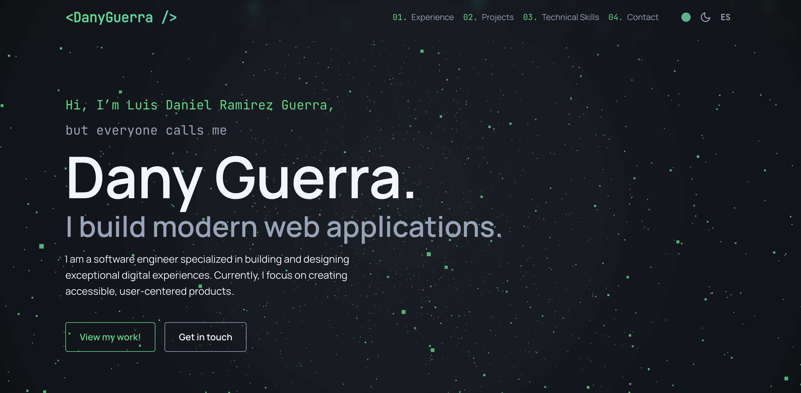

# Dany Guerra | Software Engineer

Welcome to my personal portfolio (v2). This project showcases my experience, skills, and the projects I've built throughout my career. It is designed with a focus on performance, accessibility, and a premium user experience.

## 🚀 About Me

I am a software engineer specializing in building (and occasionally designing) exceptional digital experiences. Currently, I'm focused on building accessible, human-centered products.

With experience ranging from **Junior Front-End Developer** to **Senior Full Stack Developer**, I have a strong background in:

- Building scalable micro-frontend architectures.
- Creating pixel-perfect, responsive user interfaces.
- Developing robust RESTful APIs and microservices.

## ✨ Features

- **Vue 3 + TypeScript**: Built with the latest Vue Composition API for efficient and type-safe code.
- **Interactive 3D Background**: A subtle, immersive starfield effect powered by **Three.js** that reacts to theme changes.
- **Dark/Light Mode**: Fully supported system with persistent state preference.
- **Custom Color Themes**: Personalize the site's accent color (Green, Blue, Purple, Orange) via the builtin picker.
- **Internationalization (i18n)**: Seamless **English** and **Spanish** language toggling for a broader reach.
- **Responsive Design**: Fluid typography and layouts that adapt perfectly to mobile, tablet, and desktop screens.

## 🛠️ Tech Stack

- **Framework**: Vue 3
- **Build Tool**: Vite
- **Styling**: Modern CSS (Variables, Flexbox, Grid)
- **3D Graphics**: Three.js
- **State Management**: Vue Reactivity API (Composables)

## 📫 Contact

- **GitHub**: [github.com/DanyGuerra](https://github.com/DanyGuerra)
- **LinkedIn**: [linkedin.com/in/danyguerra](https://www.linkedin.com/in/danyguerra/)
- **Email**: [ld.ramirezguerra@outlook.com](mailto:ld.ramirezguerra@outlook.com)

---

© 2021 Dany Guerra. Built with Vue 3.
